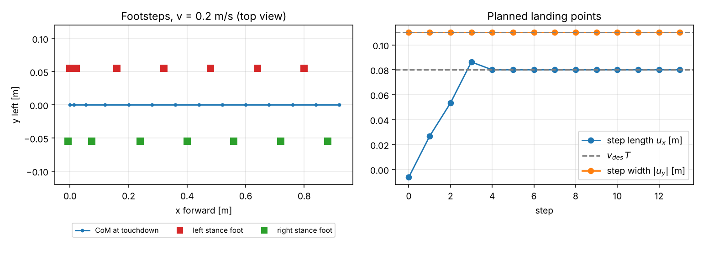
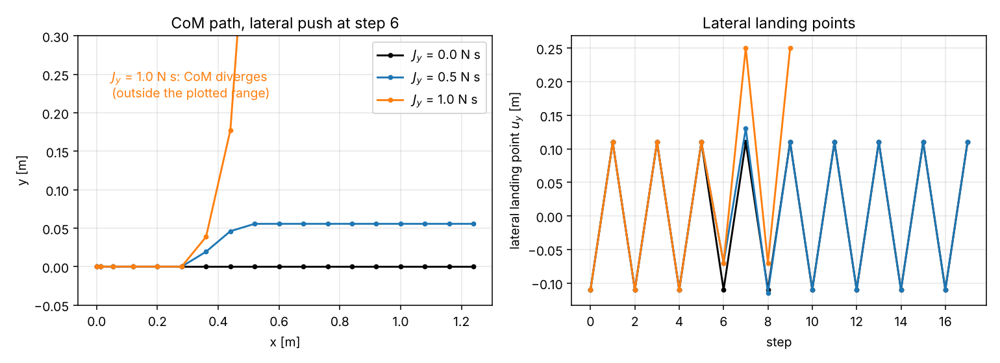
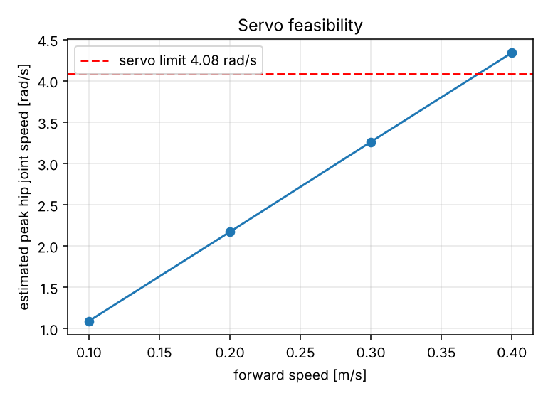

# ALIP Footstep Planner: Offline Prototype

Reduced-order study of an Angular-Momentum-based Linear Inverted Pendulum (ALIP) footstep planner [1] for Robonion.
The study quantifies, before any integration with the NMPC, how the planner behaves for the robot's mass, geometry
and servo limits: steady walking, push recovery by stepping, servo feasibility at the targeted speeds, and
sensitivity to heading error. It has no simulator dependency.

`docs/PLAN.md` lists an ALIP footstep planner, as used on ARTEMIS [4], as a candidate for the footstep-adaptation
stage. This prototype is the offline feasibility study for that option.

## Contents

| File | Description |
|---|---|
| `alip_prototype.py` | Model, footstep rule, experiments and plots |
| `results.json` | Numerical results of the default run |
| `fig1_nominal_walk.png`, `fig2_lateral_push.png`, `fig3_servo_feasibility.png` | Figures referenced below |

## Model

For each horizontal axis the state is the CoM position $q$ relative to the stance foot and the angular momentum $L$
about the stance foot, for a point mass $m$ at constant height $H$:

$$\dot q = \frac{L}{mH}, \qquad \dot L = m g\, q$$

with $(q, L) = (x, L_y)$ in the sagittal axis [1, Eq. 7] and $(q, L) = (y, L')$ in the lateral axis, where
$L' = -L_x$. The lateral equations follow from $\mathbf{L} = \mathbf{r} \times m\dot{\mathbf{r}}$ with
$\mathbf{r} = (x, y, H)$, which gives $L_x = -mH\dot y$, $L_y = mH\dot x$ and a gravity torque $(-mg\,y,\; mg\,x,\; 0)$.
With $\ell = \sqrt{g/H}$ the solution over a time $t$ is [1, Eq. 8]

$$\begin{bmatrix} q(t) \\ L(t) \end{bmatrix} =
\begin{bmatrix} \cosh \ell t & \dfrac{\sinh \ell t}{mH\ell} \\ mH\ell \sinh \ell t & \cosh \ell t \end{bmatrix}
\begin{bmatrix} q(0) \\ L(0) \end{bmatrix}.$$

At touchdown the angular momentum about the contact point is continuous, and only the position is re-referenced:
$q^+ = q^- - u$, $L^+ = L^-$, where $u$ is the landing point of the swing foot relative to the previous stance foot.

### Footstep rule

At time $t$ after touchdown, the angular momentum at the end of the step is predicted from the measured state
[1, Eq. 14]. The landing point is chosen such that the angular momentum at the end of the next step equals a desired
value $L_\mathrm{des}$ [1, Eq. 15]:

$$q^+ = \frac{L_\mathrm{des} - \cosh(\ell T)\,\hat L(T^-)}{mH\ell \sinh(\ell T)}, \qquad u = q(T^-) - q^+ .$$

The desired momentum follows from the periodic orbit of the gait with step period $T$. For a forward speed $v$ (step
length $d = vT$) and a step width $w$, with $s = +1\ (-1)$ for a left (right) stance foot in the current step:

$$L_{y,\mathrm{des}} = mH\ell \coth\!\left(\tfrac{\ell T}{2}\right)\frac{d}{2}, \qquad
L'_\mathrm{des} = s\, mH\ell \tanh\!\left(\tfrac{\ell T}{2}\right)\frac{w}{2}.$$

The landing point is then clipped to the reach limits. The interface for integration into the gait generator is

```python
landing_point(p, sag, lat, t, side, v_des) -> (u_x, u_y)
```

with `sag = (x, L_y)` and `lat = (y, L')` relative to the stance foot, `side = +1` (left) or `-1` (right), and `v_des` the
commanded forward speed.

## Parameters

| Symbol | Value | Source |
|---|---|---|
| $m$ | 7.933 kg | Sum of the link masses in `assets/robonionv2_controller.urdf` |
| $H$ | 0.48 m | CoM height used in `mpc/nmpc.py`; to be replaced by the CoM height of the crouched stepping pose |
| $T$ | 0.40 s | Single support 0.30 s plus double support 0.10 s (`GaitParams`); double support is folded into the stance period |
| $T_\mathrm{swing}$ | 0.30 s | Single-support duration |
| $w$ | 0.11 m | Twice the hip-yaw lateral offset of 0.055 m (`references/docs/joint_info.md`) |
| $w_\mathrm{min}$ | 0.07 m | Sole width 0.067 m (`SOLE_CORNERS`) plus margin |
| $u_{x,\max}$, $u_{y,\max}$ | 0.20 m, 0.25 m | Assumed from the 0.2 m + 0.2 m parallelogram legs; varied in the push study |
| $l_\mathrm{leg}$ | 0.38 m | Assumed effective hip-to-sole length for the joint-speed estimate |
| Servo limit | 4.08 rad/s | Hip servo velocity limit (`references/docs/joint_info.md`) |

The re-planning time is $0.5\,T$ after touchdown. The reach limits and $l_\mathrm{leg}$ are assumptions and should be
replaced by values from the leg kinematics.

## Usage

Requirements: Python 3.9 or newer, `numpy`, `matplotlib`.

```bash
python alip_prototype.py --out .
```

The run takes about two seconds, writes the three figures and `results.json` to the output directory, and prints
the results. Parameters are defined in the `Params` dataclass.

## Results

### Consistency check

A 40-step walk at 0.3 m/s converges to the step length (0.120 m), step width (0.110 m) and speed (0.300 m/s)
predicted by the periodic orbit. The matrix exponential of the ODE agrees with the closed form to $4 \times 10^{-16}$.
This verifies the implementation against the equations above, not the model against the robot.

### Nominal walk



The sagittal speed ramps up over three steps and settles at $u_x = vT$. The lateral motion is the periodic orbit
with $|u_y| = w$. Footsteps with fixed landing points and no feedback diverge within three steps even without a
disturbance (growth of $e^{\ell T} \approx 6$ per step), so footstep feedback is required in this model.

### Push recovery by stepping

Largest impulse in N s after which the walk continues for 12 further steps, applied 0.15 s after touchdown of the
seventh step (left stance) during a 0.2 m/s walk. `y+` points toward the stance side, `y-` toward the swing side.

| Reach assumption | x+ | x- | y+ | y- |
|---|---|---|---|---|
| 0.15 m | 0.93 | 3.07 | 0.55 | 0.55 |
| 0.25 m | 1.70 | 4.04 | 0.75 | 1.74 |
| 0.35 m | 1.70 | 4.53 | 0.94 | 2.93 |



The limits depend strongly on the assumed reach. For reaches of 0.15 to 0.25 m the lateral limits are of the same
order as the lateral push limits reported for stepping in place with the current controller (±0.5 / +1.0 N s, `docs/PLAN.md`). The model has
no ankle or torso strategy, so these values do not establish an improvement and require validation in simulation.
After a 0.5 N s lateral push the gait recovers but remains offset laterally by about 0.06 m: the planner regulates
momentum, not position.

### Servo feasibility

Peak hip joint speed of the swing leg, estimated from a minimum-jerk foot path in $T_\mathrm{swing}$, relative to the
moving CoM, divided by $l_\mathrm{leg}$:

| Speed | Step length | Peak joint speed | Servo limit 4.08 rad/s |
|---|---|---|---|
| 0.1 m/s | 0.04 m | 1.09 rad/s | within |
| 0.2 m/s | 0.08 m | 2.17 rad/s | within |
| 0.3 m/s | 0.12 m | 3.26 rad/s | within (80 %) |
| 0.4 m/s | 0.16 m | 4.34 rad/s | exceeded (106 %) |
| 0.5 m/s | | | step length exceeds the reach limit |



Varying the step period does not remove the limit at 0.4 m/s: the estimate is 4.58 rad/s at $T = 0.35$ s, 4.34 rad/s
at 0.40 s and 4.18 rad/s at 0.45 s; for $T \geq 0.5$ s the required step length exceeds the 0.20 m reach limit.
The estimate neglects knee flexion, foot lift and the parallelogram coupling and is accurate to roughly 30 %. The
targeted 0.3 to 0.4 m/s is therefore at the limit of the servos, with 0.3 m/s attainable and 0.4 m/s marginal.

### Heading sensitivity

A heading error $\psi$ produces a lateral error of $\tan\psi$ per unit distance travelled:

| Heading error | 0.5° | 1° | 2° | 3° | 5° |
|---|---|---|---|---|---|
| Lateral error over 5 m | 4.4 cm | 8.7 cm | 17.5 cm | 26.2 cm | 43.7 cm |

Absolute position and yaw are unobservable from leg kinematics and an IMU [3]; the heading reference therefore has
to come from the AHRS, whose accuracy bounds the straightness of the path. The ALIP model has no yaw state, and the
hip-yaw joints are held at their defaults in the current model. Straight-line walking requires an outer loop on
lateral position and heading in addition to the footstep rule.

## Limitations and validation status

- Reduced-order model: point mass at constant height, massless legs, instantaneous stance exchange, no ankle or
  torso strategy, no yaw dynamics.
- The lateral axis starts on its periodic orbit; starting from standstill requires a weight-shift phase that is not
  modelled.
- Reach limits, effective leg length and the joint-speed estimate are assumptions; push limits and servo margins are
  order-of-magnitude estimates.
- The planner is not coupled to the NMPC or to Isaac Lab, and no result stems from the real model or the robot.
- Equations (8), (14) and (15) of [1] were checked against the published text. The lateral-axis equations are
  derived above and have not been compared with the 3D formulation of the paper.

## References

1. Y. Gong and J. Grizzle, "Angular Momentum about the Contact Point for Control of Bipedal Locomotion: Validation in a
   LIP-based Controller", arXiv:2008.10763.
2. Y. Gong and J. W. Grizzle, "Zero dynamics, pendulum models, and angular momentum in feedback control of bipedal
   locomotion", *J. Dyn. Syst. Meas. Control* 144(12), 121006, 2022.
3. M. Bloesch, M. Hutter, M. Hoepflinger, S. Leutenegger, C. Gehring, C. D. Remy and R. Siegwart, "State Estimation for
   Legged Robots: Consistent Fusion of Leg Kinematics and IMU", *Robotics: Science and Systems*, 2012.
4. T. Zhu, M. S. Ahn and D. Hong, "ARTEMIS: An Open-Source, Full-sized Humanoid Robot for Dynamic Locomotion",
   *IEEE Humanoids*, 2025.
