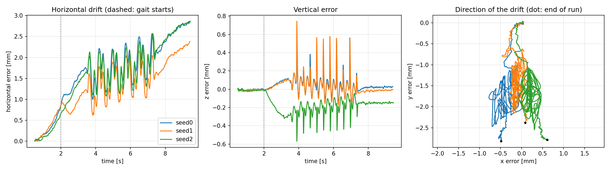
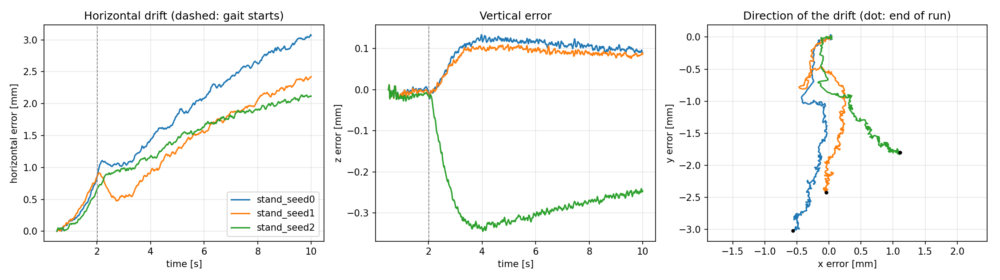
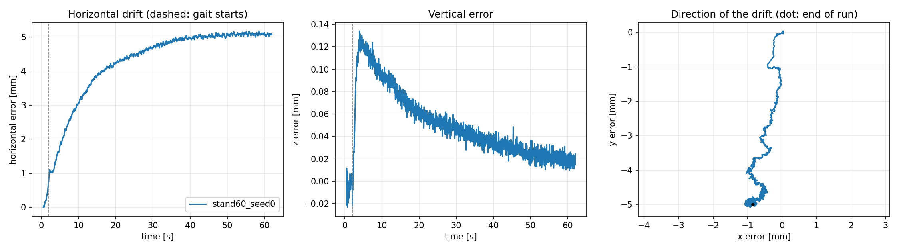

# Base-position drift of the leg-kinematics EKF: offline replay in simulation

Measurement of the drift of the base position estimated by `LegKinematicsEkf` (`mpc/ekf.py`, Bloesch et al. [1]) against
the simulator ground truth, for the stage-2 gait (stepping in place) and for standing, and its sensitivity to the filter
noise parameters. This is the offline validation described in `docs/PLAN.md`, Stage 3: record a run in Isaac Lab,
replay the filter without Isaac, and compare x, y, z with the simulator.

## Contents

| File | Description |
|---|---|
| `scripts/record_truth.py` | Isaac Lab run (same controller as `scripts/run_stepping.py`) that saves the controller inputs, the contact modes, the online estimate and the simulator base position per tick |
| `scripts/replay_ekf.py` | Offline replay of the filter on a recording, error table, figure and parameter sweeps; needs no Isaac |
| `scripts/animate_run.py` | Animation of the simulator and estimated base path, the error and the foot contacts |
| `scripts/animate_robot.py` | Stick-figure replay of the recorded joint angles and base pose (side and front view) |
| `drift_final.png`, `replay_results.txt` | Stepping runs: figure and console output of the replay and the sweeps |
| `drift_stand.png`, `replay_stand.txt` | Standing runs: figure and console output of the replay |
| `drift_stand60.png`, `replay_stand60.txt` | One 62 s standing run: figure and console output of the replay |
| `replay_viz.txt` | Viewer run (20 steps, 3 cm clearance): console output of the replay |
| `contact_viz.gif`, `robot_viz.gif` | Viewer run: animation of the base path, the error and the foot contacts; stick-figure replay |
| `robot_viser_clip2.mp4` | Screen recording of the stepping run in the Isaac Lab viser viewer (`--viz viser`), sped up 2.5 times |

The scripts are in `scripts/` of the repository, not in this folder.

## Method

Two sets of three runs with env seeds 0, 1 and 2 (the sensor-noise realization), 200 Hz, no fall in any run. The
controller sees only encoders, AHRS, gyro and accelerometer. The crouch starts at 0.5 s and the controller takes over
at 2.0 s.

- Stepping: 10 steps in place with the default gait (`T_ss` 0.30 s, `T_ds` 0.10 s, clearance 2 cm), 9.42 / 9.42 /
  9.46 s.
- Standing: no steps, `t_stand` 5 s (`--steps 0 --t_stand 5`), 10.00 s.
- Long standing: seed 0 only, `--steps 0 --t_stand 30 --timeout 60`, 62.00 s (12400 ticks).
- Viewer run: seed 0, `--viz viser --steps 20 --clearance 0.03`, 13.21 s (2643 ticks), no fall; screen-recorded. The foot
  lift is 3 cm, so the stepping is small in the viewer.

The filter observes only, so replaying the recorded inputs with other noise parameters is valid open loop. With the
default parameters the replay reproduces the online estimate of every recorded run (maximum difference 0.000 mm).

The error is the estimated base displacement minus the simulator displacement since an anchor time $t_a$:

$$e(t) = \big[\hat r(t) - \hat r(t_a)\big] - \big[r(t) - r(t_a)\big], \qquad t_a = 0.5\ \mathrm{s}.$$

The anchor skips the first ticks. Anchored at the first tick, all runs show an identical jump of about 2 mm
horizontally and 6 mm vertically within the first 0.1 s. This is not drift; its cause was not examined. The error
contains the heading error of the AHRS but not the unobservable start position [1]. The simulator position is the root
of the articulation, the estimate is the base frame; their fixed offset cancels in the displacement to first order.

## Results

### Stepping in place

Default noise parameters (`accel_density` 0.1, `slip_density` 1e-6, `yaw_std` 1°, `kinematics_std` 2 mm). Error at the
end of the run in mm unless stated; `xy@gait` is the horizontal error when the controller takes over (2.0 s), `growth`
the slope of the horizontal error after it, `travel` the horizontal displacement of the simulator base since the anchor.

| Seed | x | y | z | xy@gait | xy end | xy max | growth [mm/s] | travel |
|---|---|---|---|---|---|---|---|---|
| 0 | -0.5 | -2.8 | 0.0 | 0.9 | 2.9 | 2.9 | 0.21 | 24.9 |
| 1 | 0.1 | -2.4 | 0.0 | 0.9 | 2.4 | 2.4 | 0.19 | 27.1 |
| 2 | 0.6 | -2.8 | -0.2 | 0.7 | 2.9 | 2.9 | 0.23 | 36.2 |



Left: horizontal error over time (dashed: controller takes over). Centre: vertical error. Right: direction of the error
in the horizontal plane (dot: end of run).

### Standing

| Seed | x | y | z | xy@gait | xy end | xy max | growth [mm/s] | travel |
|---|---|---|---|---|---|---|---|---|
| 0 | -0.6 | -3.0 | 0.1 | 0.9 | 3.1 | 3.1 | 0.29 | 24.9 |
| 1 | 0.0 | -2.4 | 0.1 | 0.9 | 2.4 | 2.4 | 0.26 | 26.0 |
| 2 | 1.1 | -1.8 | -0.2 | 0.7 | 2.1 | 2.1 | 0.18 | 37.2 |



### Long standing run (62 s, seed 0)

| x | y | z | xy@gait | xy end | xy max | travel |
|---|---|---|---|---|---|---|
| -0.9 | -5.0 | 0.0 | 0.9 | 5.1 | 5.2 | 29.8 |



The horizontal error rises to about 4 mm within 20 s, then levels off at 5.1 mm between 40 s and 62 s. The vertical
error peaks at 0.13 mm after the controller takes over and decays to 0.02 mm. The error again points toward $-y$.

### Viewer run (20 steps, 3 cm clearance, seed 0)

| x | y | z | xy@gait | xy end | xy max | growth [mm/s] | travel |
|---|---|---|---|---|---|---|---|
| 0.0 | -3.5 | -0.1 | 0.9 | 3.5 | 3.5 | 0.19 | 25.5 |

Duration 13.21 s. The recorded contact modes show 20 alternating swing phases of the two feet after the controller takes
over at 2.0 s (`contact_viz.gif`), so the steps are executed in this run. The error is of the same size as in the 10-step
runs and again points toward $-y$. The travel is again dominated by the forward shift after the controller takes over
(see below).

### Simulator base displacement over time (seed 0)

Simulator base displacement since the anchor in mm, from the recordings of seed 0.

| t [s] | 1 | 2 | 2.5 | 3 | 3.5 | 4 | 6 | 8 | 9.4 |
|---|---|---|---|---|---|---|---|---|---|
| x, standing | 0.6 | 1.3 | 5.7 | 14.7 | 19.6 | 21.6 | 23.5 | 24.2 | 24.5 |
| y, standing | 0.1 | 0.0 | 0.3 | 0.4 | 0.5 | 0.7 | 1.6 | 2.3 | 2.7 |
| x, stepping | 0.6 | 1.3 | 5.7 | 14.8 | 15.1 | 10.5 | 7.6 | 22.3 | 24.8 |
| y, stepping | 0.1 | 0.0 | 0.5 | 2.7 | 20.5 | -8.2 | 14.9 | -0.5 | 1.4 |

### Observations

- The estimated base position stays within 2.1 to 3.1 mm horizontally and 0.2 mm vertically of the simulator over 9 to
  10 s, with and without steps. The horizontal error grows by about 0.9 mm during the crouch. After the controller takes
  over it grows at 0.18 to 0.29 mm/s in the 10 s runs. In the 62 s standing run (seed 0) the growth stops: the error
  levels off at about 5 mm, so over this time scale it behaves as a constant offset rather than a random walk.
- The simulator base shifts forward by about 24 mm between 2 s and 4 s, when the controller takes over from the crouch,
  and then moves little: in the standing run of seed 0 it advances 3 mm from 4 s to 9.4 s and moves 2.7 mm sideways in
  total. The stepping run ends at the same x. The shift is therefore not caused by the steps and is 8 to 11 times the
  estimation error. Only seed 0 was inspected over time; for seeds 1 and 2 the travel is 26.0 and 37.2 mm (standing)
  against 27.1 and 36.2 mm (stepping).
- While stepping the base sways sideways by up to about 20 mm (seed 0, sampled values +20.5 and -8.2 mm).
- The horizontal error points toward $-y$ in all eight runs (1.8 to 5.0 mm, $x$ within 1.1 mm) although the travel differs
  by up to 50 %. This suggests a systematic bias rather than sensor noise. Possible causes, none tested: the
  leg-kinematics model (contact point, leg asymmetry), the handling of the AHRS orientation, the frame offset between the
  estimate and the simulator root.

### Sensitivity to the noise parameters

Stepping runs. Mean over the three runs of the horizontal error at the end of the run in mm (maximum over the run in
brackets where it differs). Defaults in bold; `yaw_std` in rad.

| Parameter | Values | Error [mm] |
|---|---|---|
| `accel_density` | 0.001, 0.01, **0.1**, 1 | 2.9 (3.1), 2.8, 2.7, 2.7 |
| `slip_density` | 1e-8, **1e-6**, 1e-4 | 2.7, 2.7, 3.0 |
| `yaw_std` | 0.0087, **0.0175**, 0.05 | 2.9, 2.7, 2.6 |
| `kinematics_std` | 0.001, **0.002**, 0.005 | 2.7, 2.7, 2.7 |

Changing any of the four parameters by two to three orders of magnitude (one at a time) changes the mean end error by
at most 0.4 mm (2.6 to 3.0 mm). The residual is therefore not a matter of tuning these noise parameters.

## Usage

```bash
uv run python scripts/record_truth.py --seed 0 --record runs/seed0.npz                              # seeds 1 and 2 likewise
uv run python scripts/record_truth.py --steps 0 --t_stand 5 --seed 0 --record runs/stand_seed0.npz  # standing
uv run python scripts/record_truth.py --steps 0 --t_stand 30 --timeout 60 --record runs/stand60_seed0.npz  # 62 s
uv run python scripts/replay_ekf.py runs/seed0.npz runs/seed1.npz runs/seed2.npz --plot drift_final.png
uv run python scripts/replay_ekf.py runs/*.npz --sweep accel_density 0.001 0.01 0.1 1
uv run python scripts/record_truth.py --viz viser --steps 20 --clearance 0.03 --seed 0 --record runs/viz_seed0.npz
uv run python scripts/replay_ekf.py runs/viz_seed0.npz
uv run python scripts/animate_run.py runs/seed0.npz --out seed0.gif
uv run python scripts/animate_robot.py runs/seed0.npz --out robot_seed0.gif --speed 2
```

Run one Isaac process at a time. The controller must be built first (`scripts/build_controller.py`). The replay and
the animations need only numpy, pinocchio, casadi and matplotlib (`animate_run.py`: numpy and matplotlib).

## Limitations

- Simulation only, three seeds per set, one gait, 10 s runs, a single 62 s standing run (seed 0) and a single 13 s run
  with 20 steps at 3 cm clearance (seed 0). The paper's figure of up to 10 % of the travelled distance on hardware [1]
  refers to long walks and is not comparable.
- Only the position is scored. The yaw error, the consistency of the filter covariance with the error and the
  bias-estimation option (`estimate_bias`) were not evaluated.
- The sweeps vary one parameter at a time around the defaults and were run on the stepping runs only.
- The forward shift of about 24 mm after the controller takes over was examined over time for seed 0 only; its cause
  (for example a re-centring of the centre of mass over the feet) was not investigated.
- `animate_robot.py` is a kinematic replay of recorded joint angles, not a render of the simulator.

## References

1. M. Bloesch, M. Hutter, M. Hoepflinger, S. Leutenegger, C. Gehring, C. D. Remy and R. Siegwart, "State Estimation for
   Legged Robots: Consistent Fusion of Leg Kinematics and IMU", *Robotics: Science and Systems*, 2012.
